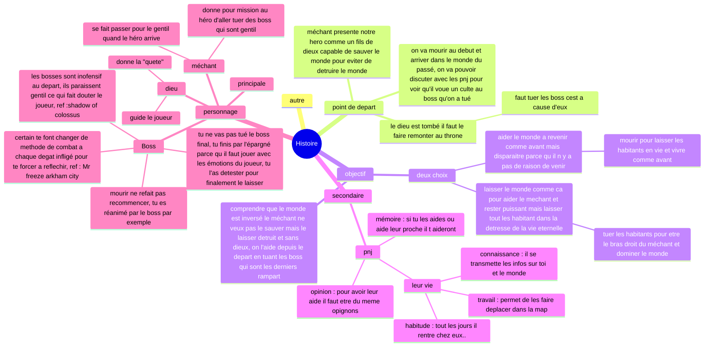
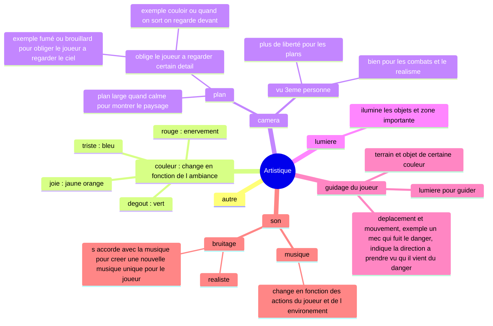
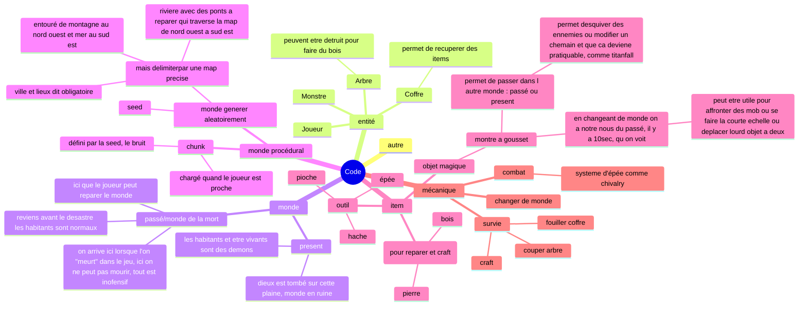

# 🌳 Adventure Game

Un monde en 2D généré de manière procédurale, inspiré de Minecraft, développé avec Python et Pygame.
Ce projet, c’est plus qu’un simple jeu : c’est un rêve d’enfant. L’envie de rassembler tout ce que j’aime dans les jeux auxquels j’ai joué, d’en faire une œuvre personnelle dont je serais fier. Le jeu vidéo est une forme d’art, et j’aimerais un jour partager le mien.

Je débute petit, en partant de zéro, avec Python. J'aimerais à terme de passer au C++, un langage que je connais encore trop peu mais que j’aimerais maîtriser. Pour l’instant, j’ai créé une carte entièrement aléatoire et jouable en 2D.

Je rêve d’un jeu vivant, avec des personnages complexes, des émotions, des retournements, une physique cohérente. Pour l’instant, je construis les bases d’un jeu de survie en 2D, mais un jour peut-être j’ajouterai de la 3D, basculerai sur C++, créerai des PNJ profonds, des mondes cohérents, des boss marquants et des mécaniques plus ambitieuses.
J’avance pas à pas, en passionné et en rêveur, pleinement conscient que ce projet pourrait ne jamais être “fini”, mais qu’il mérite d’exister.

---

## Objectifs du Projet
- [X] generer une carte completement aléatoire
- [X] Intéragir avec l'environnement
- [ ] Affichage 2D avec Pygame
- [ ] Création d'une map cohérente en utilisant des bruits et une seed
- [ ] Passer en C++

---

## Carte Mentale du Projet (Mermaid)

Ces cartes mentales me permettent d’organiser toutes mes idées sans en perdre une seule. Elles séparent l’histoire, l’aspect artistique et la partie technique du jeu afin que mon projet reste cohérent, lisible et facile à développer au fil du temps.

### 1. Histoire

### 2. Artistique

### 3. Code

